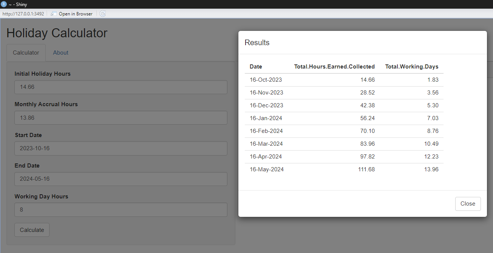

# Accrued-Vacationer Shiny App

This Shiny app helps users calculate holiday hours and working days based on the provided input values.

## Features

- **Holiday Hours Calculation**: Calculate total holiday hours accrued over a specific period.
- **Working Days Calculation**: Find out how many working days the accrued holiday hours translate to.
- **Interactive UI**: The app offers a user-friendly interface for entering input values and viewing results.

## Screenshots

## Usage

1. Open the Shiny app in R (use the `shiny_holiday.R` file).
2. Under the "Calculator" tab:
    - Enter your `Initial Holiday Hours`.
    - Enter the `Monthly Accrual Hours` - the number of holiday hours you accrue each month.
    - Set the `Start Date` and `End Date` for the calculation period.
    - Enter the `Working Day Hours` - the number of hours you work per day (default is 8).
    - Click on the `Calculate` button to compute the results.
    - You can then click on `Show Results Table` to see a detailed breakdown month by month.
3. Visit the "About" tab to get more details about the author and the app parameters.

## About the Author

- **Name**: Giuseppe Pasculli
- **GitHub**: [@joosefupas](https://github.com/joosefupas)

## Development and Contribution

If you'd like to contribute to the development of this Shiny app, please follow these steps:

1. Fork this repository.
2. Create your feature branch: `git checkout -b feature/your-feature-name`
3. Commit your changes: `git commit -am 'Add some feature'`
4. Push to the branch: `git push origin feature/your-feature-name`
5. Open a Pull Request.

## Feedback

If you have feedback or issues, please open an [issue](https://github.com/joosefupas/holiday-calculator-shiny-app/issues) on the GitHub repository.

## License

This project is open source and available under the [MIT License](LICENSE).

